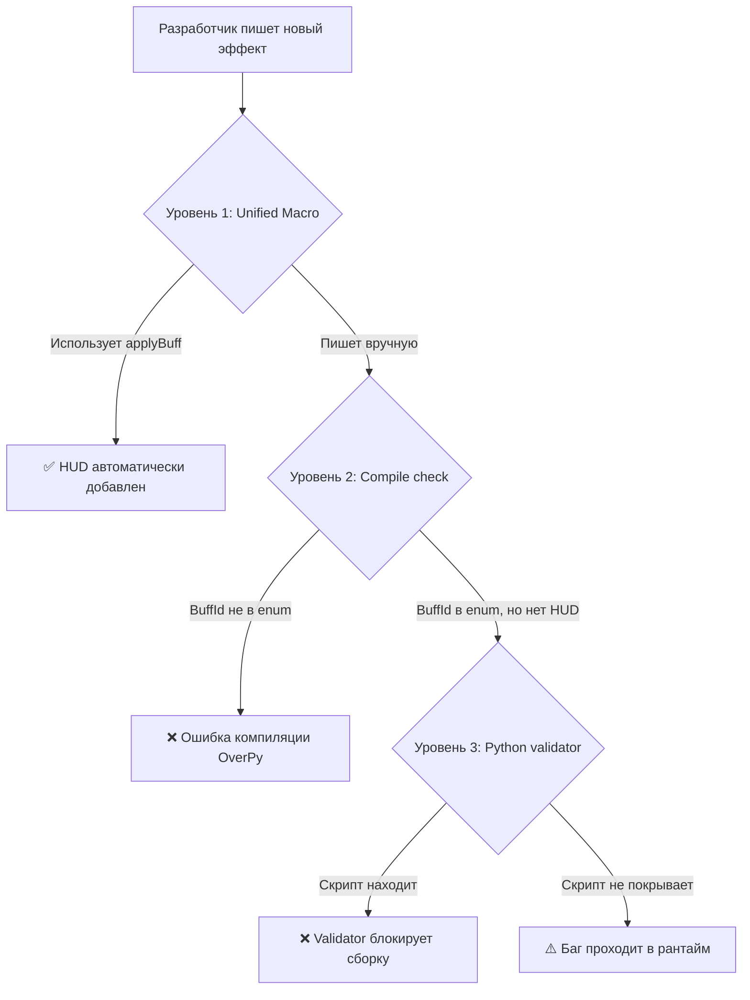

# Архитектурный анализ: неявные зависимости и пути минимизации багов

## Проблема

В текущей архитектуре MRPG Overwatch **все связи между системами — неявные**. Добавление нового баффа, класса, способности или стата требует ручного обновления множества файлов, и ни одна из этих связей не проверяется на этапе компиляции. Если разработчик (или нейросеть) забудет хоть один шаг — код скомпилируется успешно, баг всплывёт только в рантайме.

---

## Ответ на главный вопрос: можно ли забыть HUD и не получить ошибку?

**Да, можно.** Вот конкретный пример:

```python
# ✅ Разработчик написал механику кровоточения — она работает
eventPlayer.buff_append_args = [victim, getLastCreatedEntity(), 
    getTotalTimeElapsed() + 5, 10, StatType.DAMAGE, BuffType.STAT]
add_buff()

# ❌ Забыл вызвать add_hud_buff() — код компилируется без ошибок
# Результат: игрок получает дебафф, но НЕ ВИДИТ его на экране
```

Системы `effects_lifecycle` и `hud_buffs` — **полностью независимы**. Между ними нет ни одной проверки.

---

## Карта неявных зависимостей: 11 категорий, ~45 точек отказа

### Категория 1: Buff/Debuff система (Критическая)

| Шаг | Файл | Что забыли | Последствие | Компилятор ловит? |
|-----|------|-----------|-------------|:-:|
| Добавить `BuffId` в enum | [constants.opy](file:///e:/Code/Projects/mrpg_overwatch/settings/constants.opy) | Использовали число вместо enum | Коллизия ID, перезатирание чужого баффа | ❌ |
| Вызвать `add_buff()` | Файл способности | Не вызвали | Эффект вообще не применяется | ❌ |
| Вызвать `add_hud_buff()` | Файл способности | Не вызвали | Бафф невидим для игрока | ❌ |
| Правильный формат массива | Файл способности | Перепутали формат `buff_append_args` | Тихое присвоение `0` вместо реальных значений | ❌ |
| Обновить cleanup при новом `StatType` | [effects_lifecycle.opy](file:///e:/Code/Projects/mrpg_overwatch/systems/effects_lifecycle.opy) | Не добавили `elif` ветку | Стат **никогда не восстанавливается** после истечения баффа | ❌ |
| Синхронизировать `extend_buff` | Файл способности | Продлили бафф, забыли HUD | HUD показывает старый таймер | ❌ |

> [!CAUTION]
> **Самый опасный баг:** Забыть ветку cleanup в `effects_lifecycle.opy` при новом `StatType`. Стат игрока будет перманентно изменён после первого применения баффа — навсегда, даже после смерти. Игроки могут не заметить это часами.

---

### Категория 2: Классы и инициализация

| Шаг | Файл | Что забыли | Последствие |
|-----|------|-----------|-------------|
| `ClassId` enum | [constants.opy](file:///e:/Code/Projects/mrpg_overwatch/settings/constants.opy) | Нет enum-значения | Некорректная идентификация класса |
| Hero → Class маппинг | [init.opy](file:///e:/Code/Projects/mrpg_overwatch/core/init.opy) | Не добавили маппинг | Новый герой не получает класс |
| HUD имя класса | [hud.opy](file:///e:/Code/Projects/mrpg_overwatch/core/hud.opy) | Не добавили в if/elif | Класс отображается как "Unknown" |
| Инициализация переменных | [init.opy](file:///e:/Code/Projects/mrpg_overwatch/core/init.opy) | Не инициализировали | Переменные = 0/null при старте |
| Ограничения зон | Все файлы зон | Не проверили | Класс может входить куда не должен |

---

### Категория 3: Система статов

| Шаг | Файл | Что забыли |
|-----|------|-----------|
| Переменная `stat_X` | [player_vars.opy](file:///e:/Code/Projects/mrpg_overwatch/variables/player_vars.opy) | Нет переменной |
| Переменная `stat_limit_X` | [player_vars.opy](file:///e:/Code/Projects/mrpg_overwatch/variables/player_vars.opy) | Стат без верхнего предела |
| Member-макрос | [array_schemas.opy](file:///e:/Code/Projects/mrpg_overwatch/settings/array_schemas.opy) | Нет удобного доступа |
| Инициализация обоих | [init.opy](file:///e:/Code/Projects/mrpg_overwatch/core/init.opy) | Стат = 0 при старте |
| Формула левелинга | [leveling.opy](file:///e:/Code/Projects/mrpg_overwatch/core/leveling.opy) | Стат не растёт с уровнем |
| Восстановление при cleanup | [effects_lifecycle.opy](file:///e:/Code/Projects/mrpg_overwatch/systems/effects_lifecycle.opy) | Стат не восстанавливается после баффа |
| Отображение в HUD | [hud.opy](file:///e:/Code/Projects/mrpg_overwatch/core/hud.opy) | Стат невидим |
| `StatType` enum | [constants.opy](file:///e:/Code/Projects/mrpg_overwatch/settings/constants.opy) | Нельзя использовать в баффах |

---

### Категория 4: Способности

| Шаг | Файл | Что забыли |
|-----|------|-----------|
| `BuffId` для каждого эффекта | [constants.opy](file:///e:/Code/Projects/mrpg_overwatch/settings/constants.opy) | ID-коллизии |
| Playervar-переменные способности | [player_vars.opy](file:///e:/Code/Projects/mrpg_overwatch/variables/player_vars.opy) | Нет хранения состояния |
| Subroutine-объявление | [subroutines.opy](file:///e:/Code/Projects/mrpg_overwatch/variables/subroutines.opy) | Ошибка компиляции (единственная!) |
| Enum-схема массива | [array_schemas.opy](file:///e:/Code/Projects/mrpg_overwatch/settings/array_schemas.opy) | Магические числа |
| Include в main.opy | [main.opy](file:///e:/Code/Projects/mrpg_overwatch/main.opy) | Файл не подключён |
| Инициализация при join | [init.opy](file:///e:/Code/Projects/mrpg_overwatch/core/init.opy) | Мусор в переменных |
| `add_buff()` + `add_hud_buff()` | Файл способности | Невидимый бафф |
| Конфликт кнопок | Файл способности | Две способности на одну кнопку |
| Cleanup при смерти | Система смерти | Эффекты живут после смерти |

---

### Категория 5: Зоны и локации

| Шаг | Забыто | Последствие |
|-----|--------|-------------|
| Константы зоны | Нет позиции/радиуса | Зона не работает |
| Entry/exit правила | Нет обработки | Игрок не "входит" в зону |
| `current_zone` enum | Не обновлён | Другие системы не знают о зоне |
| HUD зоны | Не создан/не удалён | Утечки HUD-элементов |
| Классовые ограничения | Не проверены | Неправильный доступ |

---

### Категория 6: Смерть/возрождение

Каждая новая система с persistent-состоянием должна добавить cleanup при:
- Смерти игрока
- Выходе из матча
- Смене класса

Забыл = утечка состояния.

---

## Можно ли сделать ошибки компиляции?

### Ограничения OverPy

OverPy — это транспилятор Python → Overwatch Workshop. Он **не поддерживает**:
- Интерфейсы / абстрактные классы
- Дженерики / типы
- Статический анализ зависимостей
- Custom lint-правила
- Декораторы с логикой

Это значит, что **настоящую compile-time safety средствами самого OverPy реализовать невозможно**.

### Что МОЖНО сделать

> [!IMPORTANT]
> OverPy поддерживает макросы (`macro`) и константы (`#!define`). Это единственные инструменты "времени компиляции", но их можно использовать мощно.

---

## Рекомендации: 3 уровня защиты

### Уровень 1: Архитектурная централизация (устраняет ~60% багов)

#### 1.1 Unified Buff Registration Macro

Сейчас для добавления баффа нужно 2-3 отдельных вызова. **Объединить в один макрос:**

```python
# settings/array_schemas.opy

# Макрос, который ГАРАНТИРУЕТ вызов и add_buff(), и add_hud_buff()
macro Player.applyBuff(target, entityId, expireTime, value, statType, buffType, hudName, hudColor, buffId):
    # Механический бафф
    self.buff_append_args = [buffId, entityId, expireTime, value, statType, buffType]
    add_buff()
    # HUD бафф (автоматически!)
    self.buff_append_args = [target, expireTime, hudName, hudColor, buffId]
    add_hud_buff()
```

**Результат:** Невозможно забыть HUD — он вызывается автоматически.

#### 1.2 Unified Stat Registration

Вместо разрозненных переменных `stat_X` и `stat_limit_X` — единый массив-реестр:

```python
# Каждый новый стат = одно место регистрации
# В effects_lifecycle.opy — generic cleanup через StatType
```

#### 1.3 Class Registration Table

Вместо разбросанных if/elif по файлам — **единая таблица классов** в `constants.opy`:

```python
#!define CLASS_COUNT 1

# Реестр: [ClassId, Hero, Name, Color, SpawnPos]
#!define CLASS_REGISTRY [[ClassId.READER, Hero.ANA, "Reader", Color.YELLOW, READER_SPAWN]]
```

Все системы (HUD, init, zones) читают из одной таблицы → добавил запись = обновил везде.

---

### Уровень 2: Compile-time валидация через макросы (устраняет ~25% багов)

#### 2.1 Assertion-макросы

OverPy не имеет `assert`, но можно эмулировать compile-time проверки через **намеренные ошибки компиляции:**

```python
# Псевдо-валидация: если BuffId.NEW_EFFECT не определён, 
# макрос не скомпилируется (OverPy выдаст "undefined variable")
macro validateBuffId(id): id + 0
```

Это простой трюк: если разработчик использует `applyBuff(...)` с несуществующим `BuffId`, OverPy выдаст ошибку.

#### 2.2 Enum-enforced array format

Текущий `buff_append_args` принимает произвольный массив. Вместо этого — **именованные макросы** с фиксированными параметрами, которые невозможно передать в неправильном порядке:

```python
macro createBuffArgs(buffId, entityId, expire, value, statType, buffType):
    [buffId, entityId, expire, value, statType, buffType]
```

---

### Уровень 3: Внешний pre-compile скрипт (устраняет ~15% оставшихся багов)

> [!TIP]
> Это самый мощный инструмент. Python-скрипт, который запускается **перед** `overpy compile` и проверяет целостность кодовой базы.

#### Что может проверять скрипт:

| Проверка | Описание |
|----------|----------|
| BuffId usage | Каждый `BuffId.X` используется и в `add_buff()`, и в `add_hud_buff()` |
| StatType completeness | Каждый `StatType.X` из enum имеет ветку cleanup в `effects_lifecycle.opy` |
| ClassId completeness | Каждый `ClassId.X` присутствует в `init.opy` и `hud.opy` |
| Include check | Каждый `.opy` файл в директориях подключён в `main.opy` |
| Variable init | Каждая `playervar` инициализируется в `init.opy` |
| BuffId uniqueness | Нет дублирующихся значений в `BuffId` enum |

#### Пример скрипта:

```python
#!/usr/bin/env python3
"""Pre-compile validator for MRPG Overwatch."""

import re, sys, os
from pathlib import Path

ROOT = Path(__file__).parent

def extract_enum_values(filename, enum_name):
    """Извлекает значения из OverPy enum."""
    content = (ROOT / filename).read_text(encoding='utf-8')
    pattern = rf'enum {enum_name}:\s*\n((?:\s+\w+.*\n)*)'
    match = re.search(pattern, content)
    if not match: return []
    return re.findall(r'(\w+)\s*(?:=\s*\d+)?,?', match.group(1))

def search_in_files(pattern, directory='.', extensions=['.opy']):
    """Ищет паттерн во всех файлах."""
    results = []
    for path in ROOT.rglob('*'):
        if path.suffix in extensions and '.git' not in str(path):
            content = path.read_text(encoding='utf-8', errors='ignore')
            if re.search(pattern, content):
                results.append(path)
    return results

def validate_buff_hud_pairing():
    """Проверяет, что каждый add_buff() имеет парный add_hud_buff()."""
    errors = []
    for path in ROOT.rglob('*.opy'):
        if '.git' in str(path): continue
        content = path.read_text(encoding='utf-8', errors='ignore')
        has_add_buff = 'add_buff()' in content
        has_add_hud = 'add_hud_buff()' in content
        if has_add_buff and not has_add_hud:
            errors.append(f"  {path}: вызывает add_buff() но НЕ add_hud_buff()")
    return errors

def validate_stattype_cleanup():
    """Проверяет, что все StatType имеют ветку cleanup."""
    stat_types = extract_enum_values('settings/constants.opy', 'StatType')
    lifecycle = (ROOT / 'systems/effects_lifecycle.opy').read_text(encoding='utf-8')
    errors = []
    for st in stat_types:
        if st.startswith('_'): continue
        if f'StatType.{st}' not in lifecycle:
            errors.append(f"  StatType.{st} не имеет cleanup в effects_lifecycle.opy")
    return errors

# ... другие проверки ...

if __name__ == '__main__':
    all_errors = []
    
    print("🔍 Проверка паринга buff/hud...")
    all_errors.extend(validate_buff_hud_pairing())
    
    print("🔍 Проверка cleanup StatType...")
    all_errors.extend(validate_stattype_cleanup())
    
    if all_errors:
        print("\n❌ НАЙДЕНЫ ПРОБЛЕМЫ:")
        for e in all_errors:
            print(e)
        sys.exit(1)
    else:
        print("\n✅ Все проверки пройдены!")
        sys.exit(0)
```

Этот скрипт интегрируется в pipeline сборки:
```bash
python validate.py && npx overpy compile main.opy
```

---

## Итоговая матрица



| Уровень | Что делает | Покрытие | Сложность внедрения |
|---------|-----------|----------|:---:|
| 1. Unified macros | Объединяет связанные вызовы | ~60% багов | Средняя |
| 2. Compile-time enum checks | OverPy не даст использовать несуществующий ID | ~25% багов | Низкая |
| 3. Python pre-compile validator | Статический анализ всей кодовой базы | ~15% багов | Высокая |

> [!IMPORTANT]
> **Идеального решения не существует** в рамках OverPy. Но комбинация трёх уровней может довести покрытие до ~95-98%. Оставшиеся 2-5% — это баги в runtime-логике (неправильные значения, а не забытые вызовы), которые может поймать только тестирование.

---

## Открытые вопросы

1. **Готовы ли вы к рефакторингу?** Уровень 1 (unified macros) потребует переписать все существующие вызовы `add_buff()` + `add_hud_buff()` на новый макрос.

2. **Нужен ли Python-валидатор?** Уровень 3 — это полноценный инструмент, который нужно поддерживать. Стоит ли вкладываться сейчас или позже, когда механик станет больше?

3. **Есть ли баффы, которым НЕ нужен HUD?** Если да, unified macro должен иметь вариант без HUD (например, `applyBuffSilent()`), чтобы не загромождать экран.

4. **Приоритет:** С чего начать — unified buff macro (максимальный ROI) или Python-валидатор (максимальное покрытие)?
